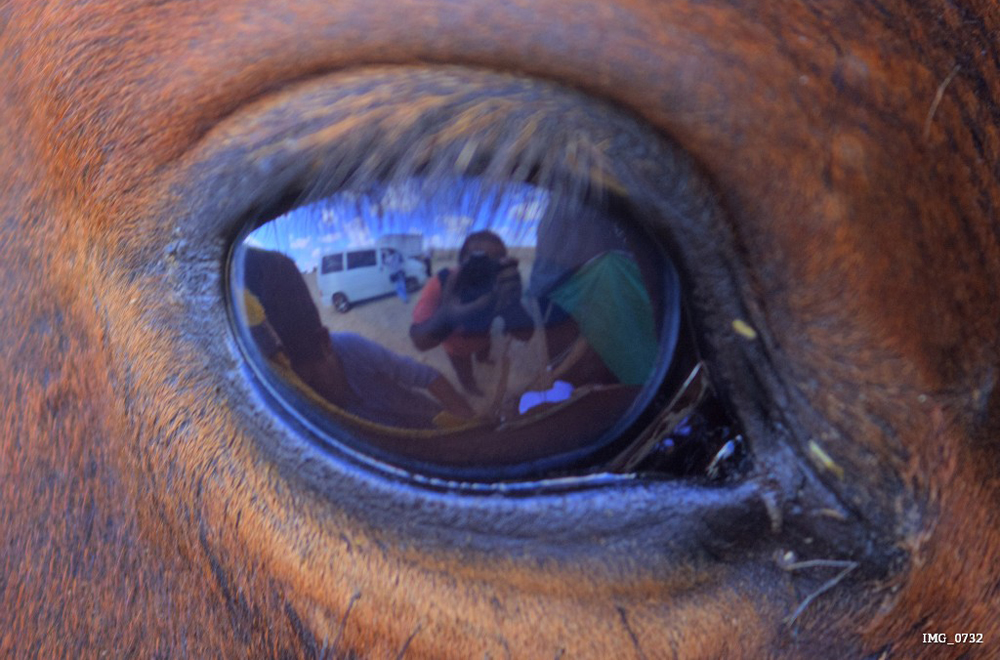
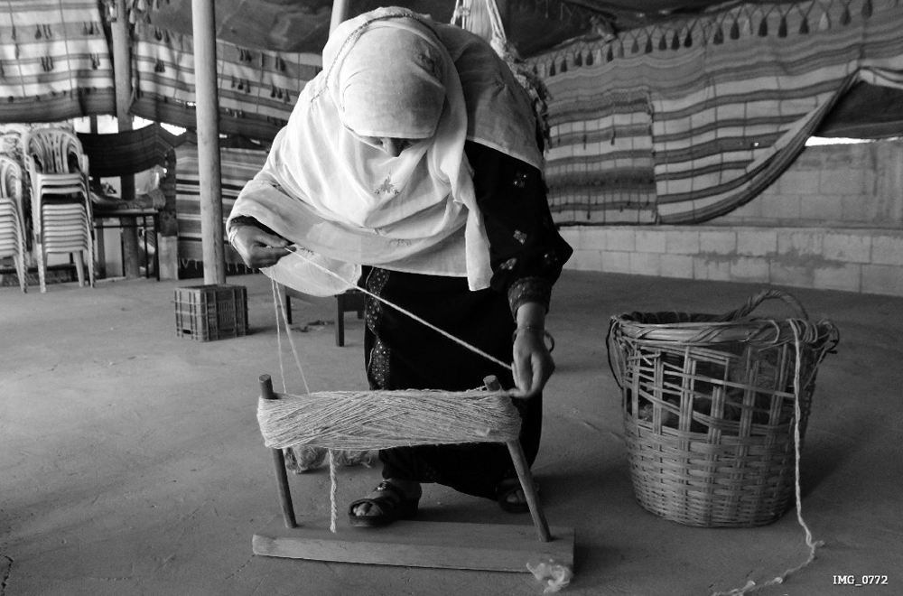
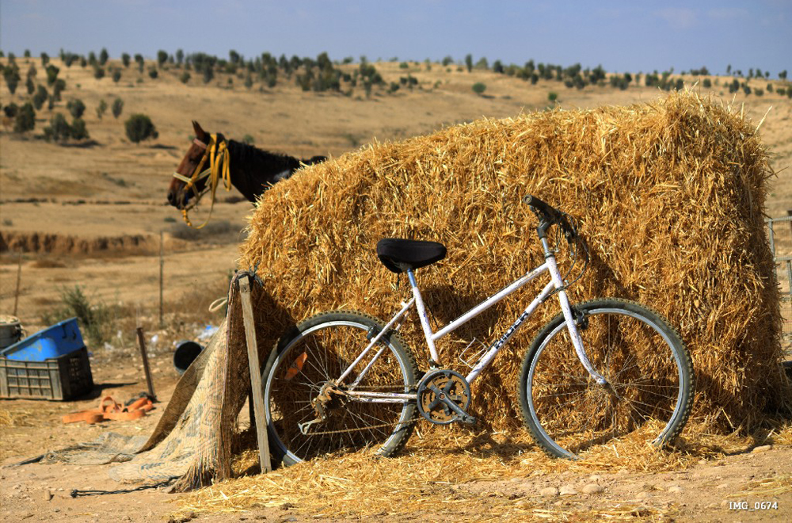
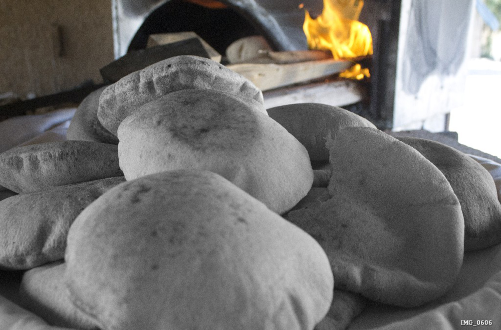

# khslider js & css2 slider 

Basic useful feature list:

 * rtl/ltr support
 * css3
 * responsive
 * more than one type of animation 
 * more than one type of controller 
 
 html specification:
```html
    <div id="sliderloader"  class="slider_outer relative  fll">
	<ul class="fll">
		<li data-title="Day on the desert" data-subtitle="need more to eat"   class="fll relative">
			
		</li>	
		<li data-title="Day on the desert"  class="fll relative">
			
		</li>	
		<li data-title="Day on the desert"  class="fll relative">
			
		</li>	
		<li data-title="Day on the desert" data-subtitle="need more to eat" class="fll relative">
			
		</li>	 
	</ul>
</div>    
```
 

load the slider:
```javascript
	$(document).ready(function(){
		jQuery('#sliderloader').loadkhSlider();
	});
```

 
 
 settings:
 ```javascript
	 $(document).ready(function(){
	 		var settings={sliderDuration:3000,  //ms=> , time between each animate
						  sliderSpeed:1000, //ms=> speed of slider, note:this option is active on mobile mode
						  isResponsive:true, //bool=> turn on/off the responsive
						  isRtl:false, //bool=> direction of the slider, true=> rtl, false=>ltr
						  isAuto:true,  //bool=> turn on/off auto animation
						  sliderType:'twodirections', // move type=>twodirections=012321023, skiptofirst=012301230123
						  controllerType:'nextprev', // nextprev=next & prev ,false= without any controller, points=points contrller
						  isMobile:false, //bool=> true= load support animated for mobile
						  isThumbs:false,//bool => turn on/off thumbs
						  isTitles:true,//bool=> true=show titles, false=hide 
				  		  issubTitles:true,//bool=> true=show sub titles, false=hide 
						  };
			jQuery('#sliderloader').loadkhSlider(settings);
	 });
 
 ```
 
 
 


 authors:
> khalil jarban


